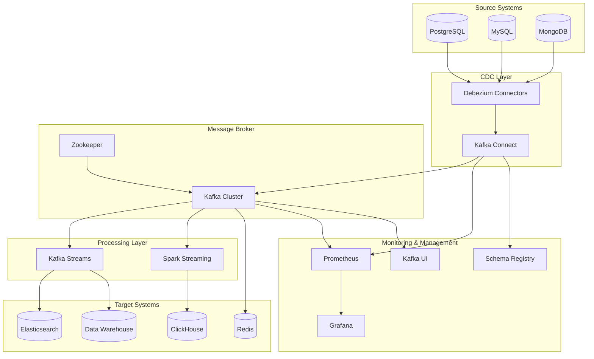
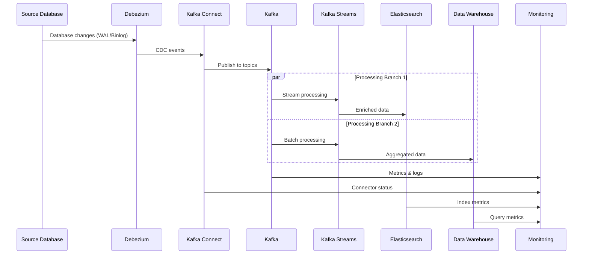

# cdc-debezium
## Overview architecure

```mermaid
graph TB
    subgraph "Source Systems"
        PG[(PostgreSQL)]
        MY[(MySQL)]
        MG[(MongoDB)]
    end
    
    subgraph "CDC Layer"
        DZ[Debezium Connectors]
        KC[Kafka Connect]
    end
    
    subgraph "Message Broker"
        KF[Kafka Cluster]
        ZK[Zookeeper]
    end
    
    subgraph "Processing Layer"
        KS[Kafka Streams]
        SP[Spark Streaming]
    end
    
    subgraph "Target Systems"
        ES[(Elasticsearch)]
        DW[(Data Warehouse)]
        CH[(ClickHouse)]
        RD[(Redis)]
    end
    
    subgraph "Monitoring & Management"
        PR[Prometheus]
        GR[Grafana]
        KU[Kafka UI]
        SC[Schema Registry]
    end
    
    PG --> DZ
    MY --> DZ
    MG --> DZ
    DZ --> KC
    KC --> KF
    ZK --> KF
    KF --> KS
    KF --> SP
    KS --> ES
    KS --> DW
    SP --> CH
    KF --> RD
    
    KF --> PR
    KC --> PR
    PR --> GR
    KF --> KU
    KC --> SC
```
## Data flow

```mermaid
sequenceDiagram
    participant DB as Source Database
    participant DZ as Debezium
    participant KC as Kafka Connect
    participant KF as Kafka
    participant KS as Kafka Streams
    participant ES as Elasticsearch
    participant DW as Data Warehouse
    participant MON as Monitoring

    DB->>DZ: Database changes (WAL/Binlog)
    DZ->>KC: CDC events
    KC->>KF: Publish to topics
    
    par Processing Branch 1
        KF->>KS: Stream processing
        KS->>ES: Enriched data
    and Processing Branch 2
        KF->>KS: Batch processing
        KS->>DW: Aggregated data
    end
    
    KF->>MON: Metrics & logs
    KC->>MON: Connector status
    ES->>MON: Index metrics
    DW->>MON: Query metrics
```
